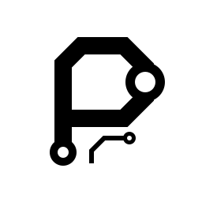

<p align="center">
  
</p>

<h1 align="center">pcb-design-to-bringup-skill</h1>

<p align="center">
  <strong>Design · Route · Build · Verify</strong><br>
  选型、画板、打样、调试。
</p>

<p align="center">
  An AI workflow for PCB design, manufacturing handoff &amp; board bring-up.<br>
  PCB 设计、制造交付与实板验证 · 内置 EasyEDA API 工具
</p>

<p align="center">
  <a href="https://github.com/Zero1683/pcb-design-to-bringup-skill/releases"></a>
  <a href="https://github.com/Zero1683/pcb-design-to-bringup-skill/stargazers"></a>
  <a href="https://github.com/Zero1683/pcb-design-to-bringup-skill/issues"></a>
  <a href="LICENSE"></a>
  
</p>

<p align="center">
  <a href="#中文">中文</a> · <a href="#english">English</a> · <a href="START_HERE.md">Quick start</a> · <a href="https://github.com/Zero1683/pcb-design-to-bringup-skill/releases">Download</a>
</p>

---

## 中文

这个 Skill 整理了 PCB 选型、画图、布线、打样和调试的步骤，配有工程记录模板。换一个 AI 接手时，可以直接查看已完成的工作、测量结果和待处理问题。

仓库包含流程文档和辅助脚本，供 AI 配合 EDA 使用。设计完成后，需要打样并进行实板测试。

### 包含什么

- **设计与调试流程**：需求与基线 → 架构与选型 → 原理图与封装 → 布局 → 布线与地铜 → 制造发布 → 装配 → 上电与下载 → 功能验证 → 交接。
- **内置 EasyEDA API Skill 1.1.28**：API、枚举、接口、源文件格式与扩展开发文档，以及本地桥接服务。
- **离线运行依赖**：附带桥接所需的 `ws`，无需另装 easyeda-api 或运行 `npm install`。
- **启动和诊断入口**：检查端口、复用已有服务、报告 EDA 连接与窗口状态。
- **项目模板与发布校验**：需求记录、检查表、交接文档，以及文件 SHA-256 清单工具。

### 环境要求

| 用途 | 要求 |
|---|---|
| 阅读与使用工程流程 | 能读取 `SKILL.md` 的 AI 工具 |
| 在线操作嘉立创EDA | Node.js 18+、支持扩展的桌面客户端、已安装并启用 Run API Gateway |
| 初始化记录、校验发布文件、运行辅助测试 | Python 3.10+ |
| 其他 EDA | 使用其原生接口和检查工具；本包只内置 EasyEDA 适配 |

请自行安装 Node.js 和嘉立创EDA桌面客户端，再到客户端扩展市场搜索并启用 **Run API Gateway**。具体步骤见 [首次使用说明](START_HERE.md)。

### 快速开始

1. 从 [Releases](https://github.com/Zero1683/pcb-design-to-bringup-skill/releases) 下载发布 ZIP，解压并保留目录结构。也可克隆整个仓库。
2. 将文件夹注册到 AI 工具的 Skill 目录，或直接让 AI 读取根目录 `SKILL.md`。EasyEDA 工具包已在目录中。
3. 打开嘉立创EDA并启用 Gateway。在本目录执行：

```sh
node scripts/easyeda_bridge.mjs start
```

Windows 也可双击 `start-easyeda.cmd`。只读查询状态：

```sh
node scripts/easyeda_bridge.mjs status
node scripts/easyeda_bridge.mjs doctor
```

| 状态 | 含义与下一步 |
|---|---|
| `BRIDGE_NOT_FOUND` | 未找到桥接；执行 `start`，启动失败时查看日志与端口占用 |
| `WAITING_FOR_EDA` | 桥接已启动；打开客户端并启用 Gateway |
| `EDA_CONNECTED` | 客户端已连接；执行操作前仍需核对目标窗口、工程和文档 |

桥接绑定 `127.0.0.1`，在 `49620` 至 `49629` 中选可用端口。不要把它暴露到公网。默认日志写入 `.runtime/`；可通过 `PCB_SKILL_STATE_DIR` 指定包外工作目录。启动器不会自动选择工程或修改 PCB。

### 如何交给 AI

```text
使用 $pcb-design-to-bringup。
根据我的功能需求与制造条件完成 PCB 设计。
先读取已有工程和交接记录，核对器件手册与封装，
对布局、布线、制造文件和实板测试分别保留证据。
记录 DRC 结果；未做的实板测试标为待测。
```

已有板子也可以只要求审查，例如：“只读检查 USB 与电源区域，不改动工程，列出证据和待核实项。”从当前需要处理的阶段开始即可。

### 工程约束

- 按器件的完整型号查数据手册，核对引脚、焊盘尺寸和间距。
- 检查旋转后的器件外形和焊盘位置，留出装配与插拔空间。
- 按实际叠层、线宽和间距计算阻抗。沿线铜间距有变化时，分段检查。
- 执行 API 修改后，读取实际结果，检查画面和连通性，必要时重新铺铜。
- 隐藏焊点需要可接触的等效测试点；记录供电、复位、启动、下载和功能测试条件。
- 根据项目要求确定尺寸、层数、铜厚、接口和装配方式。

### 目录与验证

```text
SKILL.md                  AI 入口与阶段判据
START_HERE.md             首次安装与启动
references/              分阶段工程流程、排故与经验
assets/                  PROJECT / CHECKS / HANDOFF 模板
scripts/                 桥接启动、记录初始化、发布校验
vendor/easyeda-api/       内置上游文档、桥接与 ws
agents/openai.yaml       Skill 显示信息
THIRD_PARTY_NOTICES.md    第三方来源与许可说明
```

初始化一个**尚不存在**的项目目录：

```sh
python scripts/init_project.py --output /path/to/new-project --name MyPCB
```

运行辅助脚本测试，`--workdir` 指定已有、可写的临时工作目录：

```sh
python -X utf8 scripts/test_helpers.py --workdir /path/to/workdir
```

校验 **Release ZIP 全新解压目录**中的文件清单：

```sh
python -X utf8 scripts/release_manifest.py verify --root /path/to/pcb-design-to-bringup
```

校验脚本会逐个检查文件的 SHA-256，并报告缺失、改动或新增文件。请使用全新解压的发布包，避免 `.git/` 或 `.runtime/` 被报告为新增文件。电气检查需在 EDA 和实板上另行完成。

发布前已检查解压、中文及空格路径、依赖加载、桥接启动和重复启动，11 项辅助脚本测试通过。桥接已运行到 `WAITING_FOR_EDA` 状态，连接 EDA 后的完整操作流程尚未测试。具体工程的设计检查和实板测试需要另行记录。

### 许可与反馈

本项目自有流程、模板和脚本采用 [MIT](LICENSE)。第三方内容保留原作者声明及许可，详见 [THIRD_PARTY_NOTICES.md](THIRD_PARTY_NOTICES.md)。问题和改进建议可提交到 [Issues](https://github.com/Zero1683/pcb-design-to-bringup-skill/issues)，请附复现步骤、工具版本及去除敏感信息后的错误输出。

## English

This skill covers component selection, schematics, footprints, placement, routing, fabrication, assembly, and board debugging. Project templates keep completed work, measurements, and open issues available to the next AI working on the design.

The documentation and helper scripts are intended for use with an AI and an EDA tool. Completed designs need prototypes and hardware testing.

### Included

- **Design and debugging workflow:** requirements and baseline → architecture and parts → schematics and footprints → placement → routing and ground → manufacturing release → assembly → power-up and programming → functional verification → handoff.
- **Bundled EasyEDA API Skill 1.1.28:** API, enum, interface, source-format, and extension-development references, plus the local bridge server.
- **Offline bridge dependency:** `ws` is included. No separate easyeda-api installation or `npm install` is needed.
- **Startup and diagnostics:** discover ports, reuse an existing bridge, and report desktop/window connectivity.
- **Project templates and release checks:** requirements, check records, handoff notes, and SHA-256 file manifests.

### Requirements

| Use | Requirement |
|---|---|
| Engineering workflow | An AI tool that can read `SKILL.md` |
| Live EasyEDA operations | Node.js 18+, an extension-capable desktop client, and Run API Gateway installed and enabled |
| Record initialization, manifest checks, helper tests | Python 3.10+ |
| Other EDA tools | Their native interfaces and checks; only the EasyEDA adapter is bundled |

Install Node.js and the EasyEDA desktop client separately, then find and enable **Run API Gateway** in the client's extension marketplace.

### Quick start

1. Download and extract the ZIP from [Releases](https://github.com/Zero1683/pcb-design-to-bringup-skill/releases), preserving the folder structure, or clone this repository.
2. Register the folder in your AI tool's skill directory, or ask the AI to read the root `SKILL.md`. The EasyEDA tool package is included in the folder.
3. Open EasyEDA, enable the Gateway extension, and run this from the skill folder:

```sh
node scripts/easyeda_bridge.mjs start
```

On Windows, double-click `start-easyeda.cmd`. Read-only diagnostics:

```sh
node scripts/easyeda_bridge.mjs status
node scripts/easyeda_bridge.mjs doctor
```

| Status | Meaning and next step |
|---|---|
| `BRIDGE_NOT_FOUND` | No bridge found; run `start`, then inspect logs and occupied ports if startup fails |
| `WAITING_FOR_EDA` | Bridge running; open the desktop client and enable Gateway |
| `EDA_CONNECTED` | Client connected; still verify the target window, project, and document before any operation |

The bridge binds to `127.0.0.1` and selects an available port in `49620` to `49629`. Do not expose it to the public Internet. Logs default to `.runtime/`; set `PCB_SKILL_STATE_DIR` to use a writable directory outside the package. The launcher does not select a project or modify a PCB.

### Example prompt

```text
Use $pcb-design-to-bringup to design a PCB from my functional and manufacturing requirements.
Read the existing project and handoff records first. Verify datasheets and footprints,
and keep separate evidence for placement, routing, manufacturing files, and hardware tests.
Record DRC results and mark hardware tests that are still pending.
```

For an existing board, you can request a narrower task: “Review the USB and power sections without modifying the project. List evidence and unresolved checks.” Start at the stage relevant to your task.

### Engineering principles

- Use the datasheet for the exact part number to check pins, pad dimensions, and spacing.
- Check rotated component outlines and pads, with room for assembly and connector access.
- Calculate impedance using the actual stackup, trace widths, and spacing. Check sections separately where copper clearance changes.
- Read back API edits, inspect the board view and connectivity, and rebuild copper where needed.
- Provide accessible test points for hidden joints and record power, reset, boot, programming, and functional test conditions.
- Choose dimensions, layers, copper weight, interfaces, and assembly methods for the project requirements.

### Files and verification

`SKILL.md` is the AI entry point. `references/` contains stage-specific procedures; `assets/` contains project/check/handoff templates; `scripts/` contains the launcher and helpers; `vendor/easyeda-api/` contains the upstream tool package and its runtime dependency. Detailed engineering instructions are primarily Chinese; this README is bilingual and upstream API references retain their original language.

Initialize a project in a directory that **does not yet exist**:

```sh
python scripts/init_project.py --output /path/to/new-project --name MyPCB
```

Run helper tests using an existing writable scratch directory:

```sh
python -X utf8 scripts/test_helpers.py --workdir /path/to/workdir
```

Verify a **freshly extracted Release ZIP**:

```sh
python -X utf8 scripts/release_manifest.py verify --root /path/to/pcb-design-to-bringup
```

The verifier checks each file's SHA-256 and reports missing, changed, or extra files. Use a freshly extracted release archive so that `.git/` or `.runtime/` directories are not reported as extra files. Electrical checks require separate EDA review and hardware testing.

Release checks covered archive extraction, paths containing Chinese characters and spaces, dependency loading, bridge startup, and repeated starts. All 11 helper tests passed. The bridge reached `WAITING_FOR_EDA`; operations with a connected EDA project remain untested. Record design checks and hardware tests separately for each project.

### License and feedback

Original workflow content, templates, and scripts use the [MIT License](LICENSE). Bundled third-party material retains its original notices and licenses; see [THIRD_PARTY_NOTICES.md](THIRD_PARTY_NOTICES.md). Report problems or suggestions through [Issues](https://github.com/Zero1683/pcb-design-to-bringup-skill/issues), with reproduction steps, tool versions, and sanitized error output.
