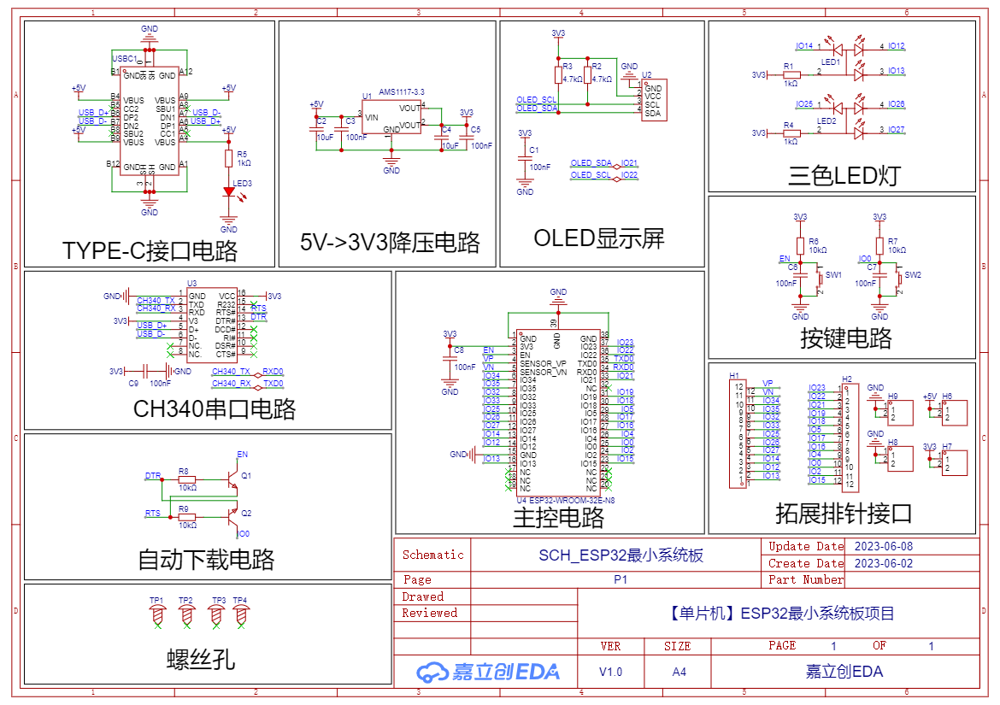

# G2: Schematic drafting and staged review

Read this before creating a schematic or adding a new functional block. Apply it together with [circuit and footprint checks](02-circuit-and-library.md). These drafting conventions organize the drawing; electrical decisions still require the exact parts' datasheets and [electrical analysis](09-electrical-analysis.md).

For EasyEDA work, also read [schematic methods](15-easyeda-schematic-methods.md). Use its block/placement operations in G2-A and selective fanout in G2-B. It adapts the bundled upstream recipes to this workflow; it does not replace the geometry, circuit or stage checks below.

## Two-stage workflow

For a new schematic, complete **G2-A: components and placement, with zero electrical wires**, inspect it, then proceed to **G2-B: wiring and electrical review**. The AI performs the intermediate review and fixes failures before wiring. Continue automatically within the authorized scope after passing; stop there only if the user requested placement only or another unresolved requirement blocks wiring.

For an existing wired design, preserve valid work. Review its current organization and connectivity without deleting wires to recreate G2-A. For a new block on an existing sheet, apply the unwired stage to that block and explicitly record the scope; the whole sheet need not have zero wires. Missing historical placement evidence remains unavailable, never a fabricated PASS.

## Functional organization

1. **Functional blocks:** group power, input protection, controller, clocks, reset, communications, sensors, actuators, and debug interfaces as applicable. Give every block a visible, meaningful title. Omit blocks the design does not need.
2. **Signal flow:** arrange input, protection/filtering, functional processing, controller, and output in a readable sequence, usually left to right. Bidirectional interfaces may use a clearly labeled branch.
3. **Power flow:** show the source connector, protection, conversion, filtering, and loads in order. Label rail voltages and destinations; show source selection and backfeed paths where relevant.
4. **Associated parts:** place decoupling capacitors, pull resistors, terminations, crystals, inductors, TVS, and ESD protection beside their associated pins or interfaces in the drawing. Record actual PCB proximity and loop requirements separately; schematic proximity is only logical organization.
5. **Signal domains:** separate high-voltage, high-current, high-speed, analog, digital, RF, and sensitive circuits into identifiable regions. Avoid mixing unrelated paths or routing noisy signals across sensitive blocks in the drawing.
6. **Ground and isolation domains:** distinguish power and signal returns and any analog/digital domains. Show where currents return and where domains join. Named functional regions do not require split copper grounds: follow manufacturer guidance and preserve appropriate continuous returns. For genuine galvanic isolation, show the barrier and every crossing explicitly; different ground symbols alone do not establish isolation or adequate PCB clearance.
7. **External interfaces:** group interface circuitry beside its connector. Put protection first in the external signal path where the device topology requires it, and carry the connector-side placement requirement into PCB layout.
8. **Controller peripherals:** arrange supporting circuits around the corresponding pin functions to reduce crossings and make critical nets easy to follow. Keep the correct symbol-to-package pin mapping when arranging or rotating symbols; drawing aesthetics cannot justify swapping pins.

For repeatable G2-A placement, follow [measured layout execution](21-layout-execution.md).
The planner preserves local block geometry, returns absolute anchor targets and
checks native observations after application and reload. Use it after local
geometry measurement; a fixed offline preview does not establish native persistence.

## G2-A: Place, organize, inspect

1. Build the expected component inventory from the selected architecture and pin requirements. Include support parts, protection, pulls, decoupling, clocks, reset, programming connectors, test points, and relevant mechanical parts. Identify DNP parts and multi-unit symbols explicitly. Unresolved selections must be listed and resolved before wiring the affected circuit.
2. Place all required symbol units on a consistent electrical snap grid. Assign unique instance reference designators, readable values, exact part/footprint associations, and fitted status. Multi-unit symbols may share their component reference, with distinct unit identifiers.
3. Apply the functional organization above. Leave room for local wires, net labels, and component annotations. Align blocks and repeated circuits, keep symbols and text from overlapping, and place module titles outside component and wiring areas.
4. Do not create electrical wires or buses yet. Use graphical primitives for frames and separators, clearly distinguished from electrical primitives. Defer external net labels, power ports, and inter-sheet connectivity until G2-B; do not let touching pin endpoints accidentally connect placed components. Account for any library-defined internal or hidden power connections in the pin review.
5. Read the actual document back. Compare expected parts against placed parts by identity, unit, value, and footprint. Inspect the rendered overview and detailed views for symbol/text overlap, missing module titles, pin accessibility, and the intended flow. A component count alone cannot detect one missing part replaced by a duplicate.
6. Count native electrical wire and bus primitives in the reviewed scope. Both counts must be **0**. Record the document/sheet IDs, scope, extraction method, counts, and snapshot identity. A screenshot alone cannot certify a zero count; if the tool cannot expose it, record the limitation and obtain a suitable native export or inspection before claiming this check passed.
7. Save the placement-only source snapshot, inventory comparison, count report, and overview/detail images. Fix omissions and overlap, then repeat affected checks. Unconnected pins are expected at this stage; do not add NC markers merely to suppress their warnings.

**G2-A acceptance:** every required component is present, symbols and annotations have no unintended overlap, every functional block has a name, placement follows the applicable organization rules, and the scoped electrical wire and bus counts are zero. The AI must inspect these results before creating wires.

## G2-B: Connect, annotate, verify

### Connections and readability

- Use native electrical wires snapped to verified pin endpoints. Prefer clear orthogonal routes and consistent spacing. Use graphical lines only for non-electrical frames and notes.
- Show local critical topologies directly: regulator feedback and energy paths, reset/boot networks, clock connections, protection, and decoupling. Use net labels for distant or cross-sheet connections without hiding the relationships needed to review the circuit.
- Make junctions explicit. Prefer T-junctions over ambiguous four-way intersections. An ordinary crossing must remain visibly and electrically unconnected; check the actual netlist rather than assuming the presence or absence of a rendered dot is decisive.
- Keep wire runs away from reference designators, values, pin numbers, and module titles. Do not route through unrelated symbols. Maintain readable text at normal page/PDF viewing size; enlarge the sheet or split it into named sheets when needed.
- Use consistent, exact net names and label scope. Distinguish voltage domains, differential polarity, active-low signals, and similarly named interfaces. Check global power names, local labels, hierarchical ports, bus members, and cross-sheet references against actual connectivity.
- Show power and ground in consistent orientations where practical, conventionally power upward and ground downward. Preserve readable signal flow when a different orientation is clearer.
- Include connector pin numbers, signal names, voltage/logic levels, and a viewing-direction note when needed to interpret the mating connector. Identify polarity, pin 1, test points, DNP options, and mutually exclusive links.
- Show component values and units consistently. Keep required ratings, tolerance, and variant information in visible annotations or linked properties/BOM so a reviewer can verify the selection. Do not replace a full part number with an ambiguous family name.

### Electrical review

1. Check each functional block against the exact datasheet and approved pin table. Include supply pins, exposed pads, reserved/unused pins, startup states, protection polarity, logic levels, and recovery interfaces.
2. Verify actual connected pin sets, intentional unconnected pins, and the boundaries between voltage/ground domains. For critical connections, use [independently specified pin relationships](13-circuit-intent-and-reuse.md) against the actual native readback. Apply NC markers only to intentionally unused pins where the datasheet permits that treatment, with the reason recorded.
3. Check power budgets, feedback/divider values, current limiting, pulls, timing, ratings, and margins using reference 09. ERC cannot establish these by itself.
4. Run native schematic rules/ERC and review individual findings. Reconcile symbol properties, footprints, fitted status, and BOM. Record justified exceptions without disabling rules to hide faults.
5. Export and inspect the completed drawing as an overview and at readable detail. Check block boundaries, title placement, references, page order, and off-sheet navigation. Include project name, sheet title/number, revision, and date in the title block for framed sheets or in a compact header/footer for free-layout sheets. Save the final source, netlist, BOM, rule report, and rendered review evidence.

**G2-B acceptance:** the completed schematic is readable, intended pin connections are verified, electrical calculations and footprint checks are recorded, and rule findings are resolved or have specific justified dispositions. Zero wires is no longer a criterion.

## Evidence and later revisions

Use the following IDs in `CHECKS.csv`. Record G2-A or G2-B in `conditions`, together with the sheet/block scope. The `baseline_id` identifies the reviewed design state; each evidence file must also identify its precise snapshot or revision.

| Check ID | Phase | Evidence |
|---|---|---|
| SCH-INVENTORY | G2-A | Expected-versus-placed identity/unit/value/footprint comparison |
| SCH-PLACEMENT | G2-A | Named blocks, flow review, overview and readable details; no unintended overlap |
| SCH-UNWIRED | G2-A | Placement-only source snapshot plus scoped native wire/bus counts of 0 |
| SCH-WIRING | G2-B | Pin-table and netlist review, intentional NC treatment, label/domain checks |
| SCH-VISUAL | G2-B | Final drawing export and visual review, including project metadata and sheet navigation |

Retain the G2-A snapshot as historical process evidence after wiring. Never reuse its zero count as a measurement of the final wired document. For a later design baseline, retain the original snapshot identity and document whether changes invalidate its inventory or placement findings. The evidence checker deliberately rejects stale baseline IDs; archive superseded rows separately and record any applicable re-review for the current baseline. Do not relabel old measurements as newly performed checks.

For existing designs where the unwired phase was not performed, record the limitation and applicability decision. Review current inventory, placement, wiring, and readability; do not erase a working circuit to manufacture historical evidence. Any new parts or changed modules require an affected-scope inventory and placement review before wiring them.

## Visual reference

This user-supplied image illustrates aligned functional blocks, visible module names, locally readable circuits, a drawing frame, and a title block. It shows a **wired** drawing and therefore illustrates final G2-B presentation. It is not a G2-A zero-wire example, a universal parts list, or an electrically validated reference circuit. Apply the organization to the current design; choose parts and connections from its own requirements and manufacturer documentation. Image provenance and licensing scope are recorded in [third-party notices](../THIRD_PARTY_NOTICES.md).

## Page plan and visual acceptance

Exactly two presentation modes are permitted for schematics created or redrafted under this skill. Choose `free-layout` or `framed-layout` before G2-A and record it in PROJECT.md; no third mode is allowed:

- **Free layout:** omit the standard outer drawing frame and title block. Arrange native graphical functional-block boxes or separators on a custom-sized canvas, with aligned headings, explanatory notes and generous whitespace. Use a compact project/revision header and relevant notes near each block. Block sizes should fit their circuits; do not force equal cells or a fixed grid. Define an explicit export rectangle enclosing all intended content with margins. Empty reserved areas are valid when no title block is present.
- **Framed layout:** retain the standard sheet frame and title block. Partition only the usable interior with graphical boxes or separators, sized to each functional block. Reserve the actual title-block area and keep all circuit content inside the inner frame. Increase sheet size or split sheets when necessary.

Honor a user-selected mode. Otherwise preserve an existing design's mode only if it is one of these two; for a new design choose based on content density and intended screen/print use and state the choice without requiring extra approval. Neither mode is a lesser fallback. The supplied examples guide composition only, not pin mapping or electrical correctness. Both modes must exist in the native editable schematic; a separately redrawn poster cannot substitute for it.

For framed layout, read the actual sheet frame and title-block bounds. For free layout, establish the custom canvas/export bounds and any reserved metadata areas. Define the usable drawing rectangle, an inset margin, and non-overlapping rectangles for named functional blocks. Reserve wiring and annotation space inside each block. Draw visible graphical separators or block frames in the native document; headings alone do not satisfy this drafting style. Keep separators in whitespace, away from symbols, text and electrical wires. An electrical wire is never a separator.

Start with the densest symbol and its longest required labels. Verify one representative block in the native renderer before replicating placement or label operations across the sheet. Use consistent text sizes for references, values, nets and headings; never shrink a subset to conceal congestion. If the library symbol's pin text is intrinsically crowded, use a verified readable symbol or edit a project-local symbol while preserving every pin number and mapping. Do not hide pin numbers or remove NC status to improve appearance.

Validate all visible geometry, including child attributes, pin names/numbers, NC markers, power symbols, labels, wires and notes, not just component origins. Every circuit block must fit inside the chosen usable rectangle and outside any reserved title-block or metadata area. Use measured rendered text bounds where available. If using estimated text bounds, label them as estimates and confirm them visually. Off-sheet attributes and clipped export content fail this check even when all component origins are inside the chosen bounds. In free layout, absence of a standard outer frame is intentional and is not a failure; cropped content or stray attributes outside the export rectangle still fail.

At G2-A, inspect the whole page and a readable detail of every block. At G2-B, repeat after wires and labels exist, before importing into PCB. Check USB connectors and dense MCU pins individually. Labels must not collide with pin numbers, values, other labels or unrelated wires. Prefer short local wires and shared ground branches over repeating a long label at every tightly spaced pin, while retaining verifiable electrical connectivity. Leave visible space between adjacent blocks and annotations.

Use native vector PDF/SVG when available and a full-page image plus detailed crops for review. A blurry screenshot, a zoomed-out overview, or successful export does not establish readability. Do not use a manually redrawn preview as evidence that the native document is correct. Enlarging paper alone also does not fix text collisions. Reflow whole blocks or split named sheets when space is insufficient, preserving the netlist.

Record `SCH-PAGE-BOUNDS` (no visible circuit content outside the selected canvas/frame bounds or over reserved metadata), `SCH-BLOCKS` (visible graphical separators and named blocks), and `SCH-TEXT` (readable non-colliding text in every block). These must pass before PCB import for new designs. Recheck the final saved/reopened drawing at G5; later annotations invalidate the affected checks.

## Bounded repair of drafting failures

Group failures by cause before editing: block placement, label placement, symbol design, coordinate transform, or renderer/export behavior. Fix one representative case, reread its state, save/reopen and inspect its rendered result before applying the fix in bulk. Record which defect was removed, not merely that an API returned success.

After two repair attempts at the same defect without visible improvement, stop repeating that edit strategy. Compare documented API coordinates, parent-local coordinates, native source coordinates, rotation and Y direction. Reproduce on a disposable symbol or restore the pre-edit snapshot, then use a verified alternative. Never negate all negative coordinates or move every attribute using an untested transform. Do not allow repeated cosmetic patches to alter pin mapping, NC semantics or connectivity. Compare netlists after any source-level repair.

If no verified path is available, mark the drawing checks FAIL/BLOCKED and state the concrete unresolved defects. A user instruction to stop repair permits a partial handoff, not a claim that presentation or full design review passed. Do not silently reclassify drafting failures as accepted limitations to complete a stage.

## Enforced disposition of nonconforming drawings

Record `SCH-FORMAT` as a required G2 check; its `actual` field is exactly `free-layout` or `framed-layout`, with native visual evidence. Bare unpartitioned symbols, headings without graphical separation, or an attractive external poster over a nonconforming native schematic fail this check. Format, clipping, illegible/overlapping text and missing partitions cannot be waived as minor warnings.

On failure: mark the affected gate FAIL, invalidate dependent visual acceptance, and do not advance from G2-A to wiring, from G2-B to PCB import, or from final review to a manufacturing-ready claim. Repair the affected block without deleting valid work. The consequence is a blocked stage and explicit incomplete delivery, never arbitrary punishment, destructive resets or fabricated PASS. For read-only or narrowly scoped existing-board work, report nonconformance without unauthorized redrafting; this does not certify the full design. An instruction to stop permits a partial handoff only.

For new designs and complete manufacturing preparation, run `check_evidence.py --root <project> --baseline <id> --through G5 --design-gates`. This profile rejects missing, non-PASS or wrong-stage format/visual/spacing gates and unrecognized format values. It validates records, not the truth of screenshots; native visual inspection remains mandatory. Do not remove required rows or omit the profile to obtain a passing report.

## Common drafting problems and first-choice remedies

| Symptom | Diagnose before editing | Preferred remedy and verification |
|---|---|---|
| Dense pin numbers and net labels collide | Actual symbol pin pitch and rendered text extents | Fix one label offset/orientation or extend its wire stub; if the symbol itself is crowded use a verified project-local symbol. Confirm pin mapping, then apply to equivalent pins. Never shrink all text. |
| Block reaches frame/title block | Full block bounds including child attributes | Move/reflow the whole block and its associated wires/labels, or enlarge/split the sheet. For free layout expand the declared export bounds with margins. Recheck nets after movement. |
| Missing partitions | Graphical primitive inventory and actual view | Add aligned non-electrical block frames/separators in reserved whitespace; inspect headings and notes at the same time. |
| NC/attribute appears far away or flips after save | Local versus world coordinates, rotation and serialized Y convention | Test one attribute against documented transforms and save/reopen. Restore a failed probe; no global sign flips or repeated raw-source rewrites. |
| Native view is sharp but exported image is blurry | Raster resolution, crop and viewer scaling | Use native vector export or adequate raster resolution with detail views. Do not move correct electrical objects to repair a screenshot. |
| Value/ref overlaps a wire | Actual text box and local wire path | Move the annotation using a consistent nearby position; reroute the local orthogonal wire only if needed. Keep part association obvious. |
| Repeated GND labels overwhelm the symbol | Ground-pin mapping and visibility | Use readable local ground branches/ports where valid, preserving every required pin connection; verify the exported pin nets. |
| ERC warning persists despite correct wiring | Exact rule, object/pin and documented intended state | Follow the warning disposition below; do not alter a correct circuit just to force a zero-warning count. |

Make one consolidated defect list per review and group it by root cause. Prepare all coordinates/clearances for the affected block before mutation. Verify the densest representative block first, apply only the proven operation to its peers, then perform one consolidated readback/render review. Stop polishing already-passing blocks unless a change invalidates them. After two ineffective attempts on the same cause, stop that method, diagnose once and choose a verified alternative; if none exists, mark BLOCKED and continue independent authorized work. Do not repeat export/zoom/reopen cycles without a new hypothesis. Never promise that one repair will always suffice.

## Small warnings and exceptions

Fix warnings by default. A warning may remain only after item-specific analysis establishes that it does not affect pin connectivity, intended operation, boot/power states, ratings, footprint mapping, assembly or fabrication. Examples can include an optional absent 3D model with independently verified mechanical dimensions, redundant descriptive metadata absent while the exact part and BOM are established, or an ERC electrical-type mismatch whose actual driver/receiver topology is verified. These are conditional examples, not a whitelist.

For each retained warning record rule ID, affected object/pin, native message, evidence and reason, scope, and recheck trigger. Keep the original rule enabled or use the tool's narrow per-object waiver. Record that the warning remains; a reviewed false-positive may satisfy the review criterion with its disposition attached, but must not be reported as zero raw warnings. Genuine unverified behavior remains NOT_RUN/BLOCKED/ACCEPTED_LIMITATION as appropriate, not PASS. Never waive unknown unconnected pins, shorts, conflicting drivers, missing supply/ground, boot/reset faults, incorrect pin/footprint mapping, insufficient electrical clearances, overlapping pads/silk, missing blocks, unreadable text or clipped circuit content. Do not ask the user to approve each harmless explained warning when its disposition is within the existing design scope.
